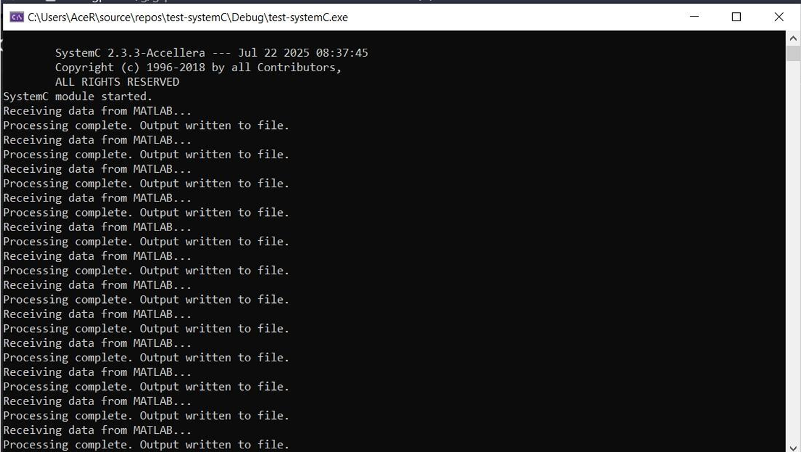
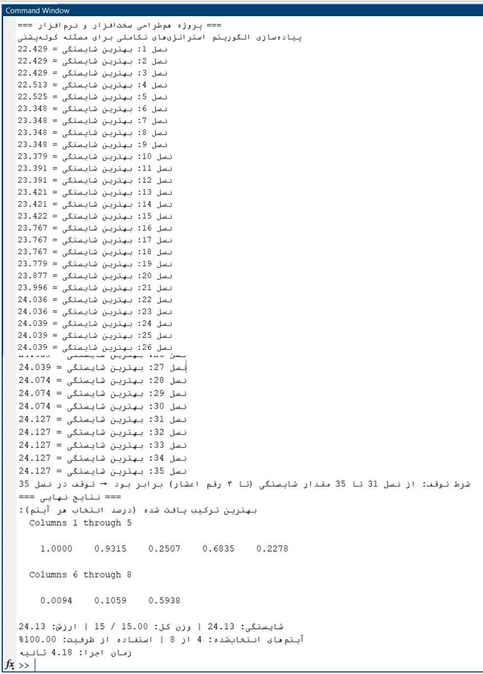
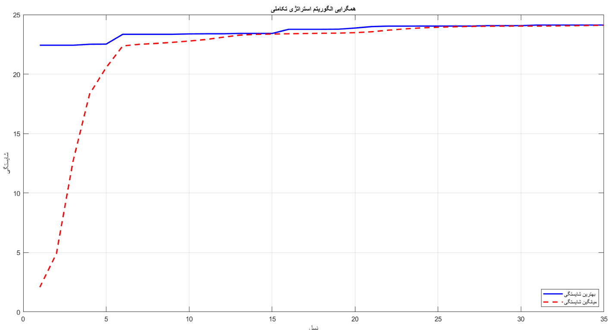
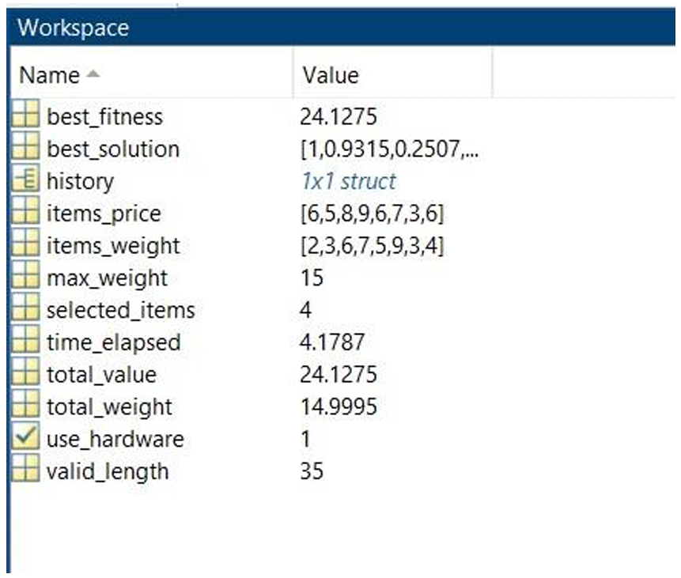

# Evolutionary Strategy for Embedded Systems
*A hardware–software co-design project using MATLAB (orchestration) and SystemC (genetic operators) to solve a fractional knapsack optimization problem.* 【20†source】

> **At a glance**
> - Evolutionary Strategy (ES) with tournament selection, single‑point crossover, Gaussian mutation, survivor selection, and patience‑based stopping. 【20†source】  
> - Clear partitioning: MATLAB handles initialization, fitness, selection & visualization; **SystemC** performs recombination and mutation; file‑based IPC connects both sides. 【20†source】  
> - Demonstrated higher solution quality vs a software‑only baseline on the provided dataset. 【20†source】

---

## Repository Structure
```
.
├── Hardware/                      # SystemC sources
│   ├── main.cpp
│   ├── evolutionary_strategy.h
│   ├── recombination_module.h
│   └── mutation_module.h
├── Software/                      # MATLAB sources
│   ├── main_script.m
│   ├── evolutionary_strategy_knapsack.m
│   ├── evolutionary_strategy_knapsack_software.m
│   ├── evaluate_fitness.m
│   ├── select_parents.m
│   ├── hardware_accelerated_operations.m
│   └── software_based_operations.m
├── Reports/
│   ├── Report.pdf
│   └── Images/
│       ├── img_01_command-window_generations-1-35_best-fitness-24_1275.png
│       ├── img_02_convergence-plot_best-vs-moving-best.png
│       ├── img_03_matlab-workspace_run-summary.png
│       └── img_04_systemc-console_file-ipc-loop.png
├── LICENSE
└── README.md
```
(Your PDF report summarizes the full method and code listings.) 【20†source】

---

## Problem
- **Objective:** maximize total value under a weight limit (*fractional knapsack*).  
- **Dataset (example in report):**  
  - Values: `[6, 3, 7, 6, 9, 8, 5, 6]`  
  - Weights: `[4, 3, 9, 5, 7, 6, 3, 2]`  
  - Max weight: `15`  【20†source】  
- **Chromosome:** length‑8 vector with continuous genes in `[0,1]` (fractional usage).  
- **Fitness:** total value with a linear penalty if total weight exceeds the limit. 【20†source】

---

## Method (Evolutionary Strategy)
- **Initialization:** random population in `[0,1]`.  
- **Fitness evaluation:** penalized value as above.  
- **Parent selection:** *tournament selection*.  
- **Recombination:** *single‑point crossover*.  
- **Mutation:** add Gaussian noise, then clamp to `[0,1]`.  
- **Survivor selection:** keep the fittest candidates.  
- **Early stopping:** stop if best fitness doesn’t improve for **5** consecutive generations after a warm‑up.  
- **Default hyperparameters:** `population_size=50`, `offspring_per_gen=30`, `recombination_rate=0.7`, `mutation_rate=0.1`. 【20†source】

---

## Co‑Design Architecture
**MATLAB (software):** initialization, fitness evaluation, parent selection, visualization.  
**SystemC (hardware‑model):** kernels for recombination & mutation.  
**IPC (file‑based):**  
- `matlab_to_systemc.dat` – selected parents  
- `params.dat` – `recombination_rate  mutation_rate`  
- `systemc_to_matlab.dat` – offspring returned by SystemC  【20†source】

<p align="center">
  
</p>

---

## Results (sample run)
| Metric | Co‑Design (MATLAB+SystemC) | Software‑Only (MATLAB) |
|---|---:|---:|
| **Best fitness** | **24.13** | 22.54 |
| **Generations to stop** | **35** | 14 |
| **Runtime** | **4.18 s** | 0.01 s |
| **Capacity used** | **100.00%** | 99.67% |
| **Effective items** | **4** | 3 |

**Best solution (genes):** `[1.0000, 0.9315, 0.2507, 0.6835, 0.2278, 0.0094, 0.1059, 0.5938]`  
**Best fitness:** `24.1275` with total weight `≈ 14.9995` (≈**99.99%** capacity).  【20†source】

<p align="center">
  <br>
  <br>
  
</p>

> Interpretation: the co‑design run achieves a higher‑quality solution, while the software‑only run is faster due to eliminating IPC and SystemC simulation overhead. The modular design allows porting the kernels to synthesizable hardware in future work. 【20†source】

---

## How to Run

### A) Co‑Design mode (MATLAB + SystemC)
1. **Build SystemC binary** (example with `g++` on Linux/Mac; adjust for your SystemC install path):
   ```bash
   g++ -std=c++17 -I"$SYSTEMC_HOME/include" -L"$SYSTEMC_HOME/lib-linux64"        Hardware/main.cpp -o build/systemc_es        -lsystemc -Wl,-rpath,"$SYSTEMC_HOME/lib-linux64"
   ```
   On Windows, build with Visual Studio and link against `systemc.lib` (x64).  
2. **Run MATLAB** and set `use_hardware = true` in `Software/main_script.m`.  
3. Execute the script. MATLAB writes parents/params, SystemC returns offspring, and plots/logs are produced. 【20†source】

### B) Software‑only mode (MATLAB)
1. Set `use_hardware = false` in `Software/main_script.m`.  
2. Run the script to execute the ES loop purely in MATLAB. 【20†source】

---

## Reproducibility Tips
- Fix random seeds in both MATLAB and C++ for repeatable runs.  
- Ensure the IPC temp files are cleaned between runs (the scripts handle this automatically). 【20†source】

---

## Credits & Course Info
This project was completed for the **System‑Level Design (Hardware–Software Co‑Design)** course, instructed by **Dr. Hoda Roudaki Lavasani** (term 4032). 【20†source】

---

## License
Released under the **MIT License** (see `LICENSE`).
